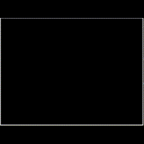
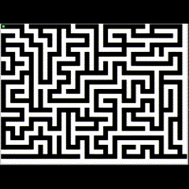

# Maze-Generation-in-C
Solving Randomly Generated Mazes

## Maze is created using Randomized DFS
### Make sure u have the SDL library Files 
run 'make' command in terminal 
```console
make
```
`Makefile Written for Ubuntu` <br>
then ./app to run program
```console
./app
```
 

